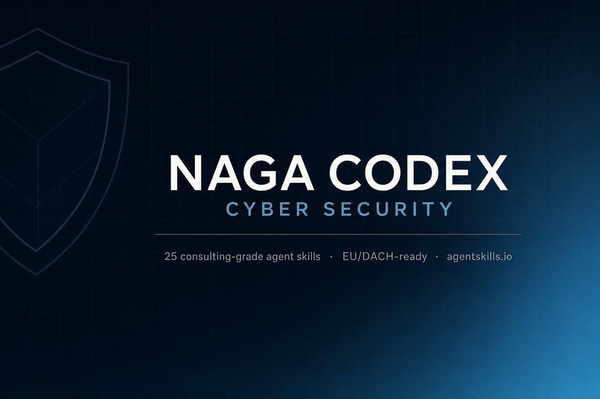
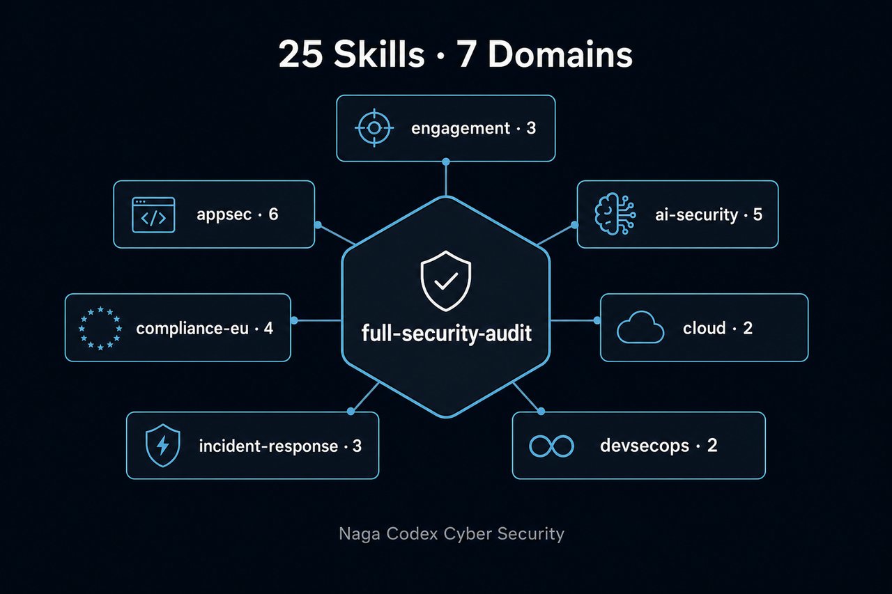

# Naga Codex Cyber Security

**Consulting-grade cybersecurity skills for AI agents.**  
Curated · Framework-grounded · EU/DACH-ready · [agentskills.io](https://agentskills.io) portable

[](LICENSE)
[](docs/catalog.md)
[](https://agentskills.io)
[](https://nagacodex.cloud)


<p align="center">
  
</p>


> Give any coding agent the operating system of a Naga Codex security engagement —  
> not a dump of 800 unchecked prompts.

---

## Why this exists

Open-source agent security packs fall into three traps:

1. **Mega libraries** (e.g. 800+ skills) — impressive breadth, noisy discovery, weak client delivery  
2. **Code-only packs** — strong AppSec, thin on AI agents, MCP, and EU regulation  
3. **AI-only packs** — strong LLM checks, no engagement workflow or DACH compliance  

**Naga Codex Cyber Security** is a **curated pack of 25 production skills** built for real audits:

- Authorization gate before any active testing  
- AppSec + API + secrets + SBOM  
- OWASP LLM Top 10 **2025** + Agentic Top 10 **2026** + MCP review  
- GDPR · NIS2 · ISO 27001 · BSI IT-Grundschutz mapping  
- Bilingual **EN/DE** client reports  
- Normalized finding JSON schema  
- One orchestrator skill: `full-security-audit`

See [docs/why-naga-codex.md](docs/why-naga-codex.md) for the competitive comparison.

---

## Quick install

```bash
git clone https://github.com/Nagacash/NagaCodex-cyber-security.git
cd NagaCodex-cyber-security

# Claude Code (user-global)
./install.sh claude

# Claude Code (this repo only)
./install.sh project-claude

# Cross-client standard path
./install.sh agents

# Cursor
./install.sh cursor
```

Or copy any `skills/<domain>/<skill>/` folder into your agent's skills directory.

**Works with:** Claude Code · Cursor · Windsurf · Codex CLI · Gemini CLI · Copilot · Hyperagent · any [agentskills.io](https://agentskills.io)-compatible agent.

---

## Skill map (25)

<p align="center">
  
</p>


| Domain | Skills | Focus |
|--------|--------|-------|
| **engagement** | 3 | Authorization gate, kickoff, EN/DE client report |
| **appsec** | 6 | Code review, OWASP web/API, secrets, SBOM, headers/TLS |
| **ai-security** | 5 | LLM Top 10, Agentic Top 10, prompt injection, MCP, agent IAM |
| **cloud** | 2 | AWS/Azure/GCP posture, IaC + containers |
| **compliance-eu** | 4 | GDPR technical, NIS2, ISO 27001, BSI mapping |
| **incident-response** | 3 | IR triage, STRIDE, ATT&CK mapping |
| **devsecops** | 2 | CI security pipeline, full-audit orchestrator |

Full list: [docs/catalog.md](docs/catalog.md)

---

## Example prompts

```text
Run a full Naga Codex security audit on this repository (static analysis only — we own the code).
Produce findings JSON and a German management summary.
```

```text
Review this MCP server for over-permissioning and data exfil paths.
```

```text
Technical GDPR review of our user-data flows. Engineering gaps only — not legal advice.
```

More: [docs/example-prompts.md](docs/example-prompts.md)

---

## Finding format

Every technical skill emits findings compatible with:

- Markdown: [`templates/finding.md`](templates/finding.md)  
- JSON Schema: [`schemas/finding.schema.json`](schemas/finding.schema.json)  
- Client reports: [`templates/report-en.md`](templates/report-en.md) · [`templates/report-de.md`](templates/report-de.md)  
- Severity: [`docs/severity-rubric.md`](docs/severity-rubric.md)

```json
{
  "schema_version": "1.0.0",
  "engagement": {
    "id": "NC-20260818-001",
    "timestamp": "2026-08-18T12:00:00Z",
    "target": "github.com/acme/app",
    "authorization_confirmed": true
  },
  "skill": { "name": "secure-code-review", "version": "1.0.0" },
  "findings": [
    {
      "id": "SCR-001",
      "title": "Missing authorization on invoice fetch",
      "severity": "high",
      "status": "open",
      "cwe": ["CWE-639"],
      "description": "...",
      "evidence": [{ "location": "api/invoices.ts:42", "summary": "IDOR via invoiceId" }],
      "remediation": { "guidance": "Enforce tenant-scoped authz before load", "priority": "immediate" }
    }
  ]
}
```

---

## Framework coverage

Skills map to **published** controls only (never invented IDs):

| Framework | Where used |
|-----------|------------|
| OWASP Top 10 / API Top 10 / ASVS | AppSec skills |
| OWASP LLM Top 10 2025 | `llm-top10-review`, prompt injection |
| OWASP Agentic Top 10 2026 | `agentic-top10-review`, agent permissions |
| MITRE ATT&CK / ATLAS / D3FEND | IR + AI skills |
| NIST CSF 2.0 · AI RMF · SP 800-61 | Engagement, IR, AI governance |
| GDPR · NIS2 · ISO 27001:2022 · BSI IT-Grundschutz | `compliance-eu/*` |
| CIS Benchmarks · SLSA · CycloneDX/SPDX | Cloud, SBOM, pipeline |
| CWE | All technical findings |

---

## Ethics

**Authorized use only.** Read [docs/ethics-and-authorization.md](docs/ethics-and-authorization.md).

- No testing without written scope  
- No exploit weapon dumps  
- Redact secrets and PII in all outputs  
- Prefer static / read-only analysis first  

---

## Repository layout

```
NagaCodex-cyber-security/
├── skills/                 # agentskills.io skill tree
│   ├── engagement/
│   ├── appsec/
│   ├── ai-security/
│   ├── cloud/
│   ├── compliance-eu/
│   ├── incident-response/
│   └── devsecops/
├── schemas/finding.schema.json
├── templates/              # finding + EN/DE reports
├── docs/                   # catalog, ethics, rubric, examples
├── install.sh
├── NOTICE                  # provenance & inspiration credits
└── LICENSE                 # MIT
```

---

## Inspired by (not a fork)

This is **original Naga Codex work**. Design patterns were studied across the 2025–2026 agent-skills ecosystem, including:

- [mukul975/Anthropic-Cybersecurity-Skills](https://github.com/mukul975/Anthropic-Cybersecurity-Skills) — scale & multi-framework mapping  
- [OWASP/secure-agent-playbook](https://github.com/OWASP/secure-agent-playbook) — play discipline & structured findings  
- [UnitOneAI/SecuritySkills](https://github.com/UnitOneAI/SecuritySkills) — framework honesty & normalized output  
- [olanokhin/agent-security-skill](https://github.com/olanokhin/agent-security-skill) — LLM + Agentic layered model  
- [agentskills.io](https://agentskills.io) — portable skill standard  

Full attribution notes: [NOTICE](NOTICE)

---

## Naga Codex

Security · AI management · Film  
**[nagacodex.cloud](https://nagacodex.cloud)**

Built for engagements where the deliverable is a **decision-ready report**, not a wall of unchecked model output.

---

## Contributing

1. Follow `docs/skill-template.md`  
2. Real framework IDs only  
3. Keep `SKILL.md` lean; deep lists go in `references/`  
4. Update `docs/catalog.md` when adding skills  


## Visual assets

| File | Use |
|------|-----|
| [`assets/hero-banner-photo.svg`](assets/hero-banner-photo.svg) · [`.jpg`](assets/hero-banner.jpg) | README hero |
| [`assets/og-card.svg`](assets/og-card.svg) · [`.jpg`](assets/og-card.jpg) | GitHub social / Open Graph preview |
| [`assets/skill-map-photo.svg`](assets/skill-map-photo.svg) · [`.jpg`](assets/skill-map.jpg) | Domain map diagram |
| [`assets/mark.svg`](assets/mark.svg) · [`.jpg`](assets/mark.jpg) | Brand mark |

**Set the GitHub social preview:** Repository → **Settings** → **General** → **Social preview** → upload `assets/og-card.jpg` (GitHub prefers raster for the social image).

---

## License

MIT © 2026 Naga Codex / Maurice Holda
